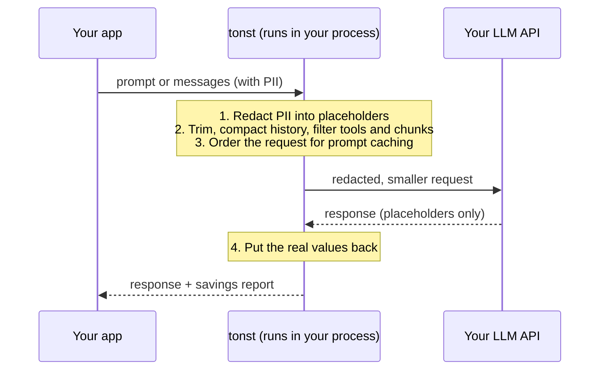

# tonst — Token Optimization & Security Tool

tonst is a Python library that sits between your application and a paid LLM
API. Before each request leaves your machine it removes personal data and
cuts the tokens you pay for; after the response comes back it puts the
personal data back.

It runs in your own process. There is no proxy, server or account, and
nothing is sent anywhere except the request you were already making.



**What it does**

| Feature | What it saves or protects | Where it helps |
|---|---|---|
| PII redaction | Emails, cards, phones, IPs and (optionally) names, employers and codenames never reach the provider | Every request |
| Mechanical trim | Duplicate lines and wasted whitespace | Every request |
| Tool / MCP definition filtering | Sends only the tool definitions a request needs (−51% to −55% cost in live tests) | Agents and tool-calling apps |
| Rolling history compaction | Summarizes old turns instead of re-sending or silently dropping them | Long chats and agent loops |
| RAG context optimization | Drops duplicate and (optionally) irrelevant retrieved chunks | Retrieval pipelines |
| Prompt-caching structuring | Orders and marks requests so the provider's own cache discounts the repeated part | Stable system prompts and reference docs |
| Savings log + `tonst stats` | A local record of what was saved, with no prompt content | Monitoring |

It works with Anthropic, OpenAI and Gemini, and with any other provider
through a function you supply. Measured results are summarized
[below](#results) and detailed in [docs/results.md](docs/results.md).

---

## Contents

- [Install](#install)
- [Quickstart](#quickstart)
- [Using tonst in your application](#using-tonst-in-your-application)
  - [1. Connect your model](#1-connect-your-model)
  - [2. Pick the features for your workload](#2-pick-the-features-for-your-workload)
  - [3. Recipes](#3-recipes)
  - [4. Production checklist](#4-production-checklist)
- [Configuration reference](#configuration-reference)
- [Results](#results)
- [Limitations](#limitations)
- [Documentation](#documentation)
- [Whitepaper, license and contributing](#whitepaper-license-and-contributing)

---

## Install

Requires Python 3.9+. tonst isn't on PyPI yet; install it from GitHub:

```bash
pip install "git+https://github.com/v-nightwolf/tonst.git"
```

For production, pin a specific commit or tag so an update never surprises you:

```bash
pip install "git+https://github.com/v-nightwolf/tonst.git@<commit-or-tag>"
```

The only required dependency is `requests`. Two optional pieces add
capability:

| Optional piece | What it adds | Install |
|---|---|---|
| GLiNER | Free-text PII detection (names, employers, codenames) on CPU | `pip install "tonst[gliner] @ git+https://github.com/v-nightwolf/tonst.git"` (pulls in `torch`, `transformers`) |
| [Ollama](https://ollama.com) | A local model for history summaries or compression, e.g. `ollama pull gemma2:2b` | Separate app, not a pip package |

Neither is needed for the quickstart. If an optional piece is missing, the
feature that uses it is skipped rather than breaking the request.

## Quickstart

Wrap the function you already use to call your model. tonst takes a
function from prompt text to response text:

```python
import anthropic
from tonst import TonstClient

api = anthropic.Anthropic()          # reads ANTHROPIC_API_KEY

def call_model(prompt: str) -> str:
    resp = api.messages.create(
        model="claude-sonnet-4-6", max_tokens=1024,
        messages=[{"role": "user", "content": prompt}],
    )
    return "".join(b.text for b in resp.content if b.type == "text")

client = TonstClient(call_fn=call_model)

answer, report = client.query(
    "Customer jo@example.com says order 4471 arrived broken.\n"
    "Customer jo@example.com says order 4471 arrived broken.\n"
    "Draft a short, polite reply."
)

print(answer)                     # real email address restored in the reply
print(report.redacted_fields)     # 1 -- the model saw [[EMAIL_…]], not the address
print(report.tokens_saved, report.percent_saved)   # the duplicate line was trimmed
print(report.local_overhead_ms)   # tonst's own time before the API call
```

Any provider works the same way: `call_model` is your code, so it can call
OpenAI, Gemini, Bedrock, a self-hosted model or an internal gateway.

---

## Using tonst in your application

### 1. Connect your model

tonst never calls a provider on its own. You give it one of two functions:

| | `call_fn(prompt: str) -> str` | `messages_fn(messages: list[dict]) -> str` |
|---|---|---|
| Receives | One flattened, redacted prompt string | The redacted `{"role", "content"}` list, system messages included |
| Best for | Single-shot requests: classification, extraction, drafting | Chat apps and anything that needs roles or prompt caching |
| Can report real usage | No | Yes: return `(text, usage)` |

With `messages_fn`, use the adapters in `tonst.adapters` to convert the
message list for your provider and to read the provider's usage block
back. Returning usage lets tonst report real billed and cached tokens, and
lets cache-aware compaction see how well the provider is actually caching.

**Anthropic**, with prompt-caching breakpoints set for you:

```python
import anthropic
from tonst import TonstClient
from tonst.adapters import to_anthropic, usage_from_anthropic

api = anthropic.Anthropic()

def call_claude(messages):
    resp = api.messages.create(model="claude-sonnet-4-6", max_tokens=1024,
                               **to_anthropic(messages))
    text = "".join(b.text for b in resp.content if b.type == "text")
    return text, usage_from_anthropic(resp)

client = TonstClient(messages_fn=call_claude)
```

**OpenAI**, which caches repeated prefixes automatically:

```python
from openai import OpenAI
from tonst.adapters import to_openai, usage_from_openai

oa = OpenAI()

def call_openai(messages):
    resp = oa.chat.completions.create(model="gpt-4o", messages=to_openai(messages))
    return resp.choices[0].message.content, usage_from_openai(resp)
```

**Gemini** (REST), where implicit caching is automatic but best-effort:

```python
import os, requests
from tonst.adapters import to_gemini, usage_from_gemini

URL = "https://generativelanguage.googleapis.com/v1beta/models/gemini-3.8-flash:generateContent"

def call_gemini(messages):
    resp = requests.post(URL, headers={"x-goog-api-key": os.environ["GEMINI_API_KEY"]},
                         json=to_gemini(messages), timeout=120).json()
    parts = resp["candidates"][0]["content"]["parts"]
    return "".join(p.get("text", "") for p in parts if not p.get("thought")), usage_from_gemini(resp)
```

A client built with `messages_fn` also handles `query()`, `query_structured()`
and `query_rag()`: they send it a single user message.

### 2. Pick the features for your workload

Everything except regex redaction and mechanical trim is off until you
turn it on.

| Your workload | Turn on | Why |
|---|---|---|
| Any app sending user text | `redaction_backend="regex"` (default); `"gliner"` if prompts contain names or free-text personal data | Keeps PII off the provider |
| Chat app or support bot | `query_messages()` with a `RollingSummary` per conversation, `background_summary=True` | Bounded history without losing facts, no added latency |
| Chat app on a provider with prompt caching | Also `compaction_cache_aware=True` and pass usage back from `messages_fn` | Summarizes only when it pays off against the cache |
| Agent or tool-calling app | `select_tools()` / `ToolSession` on your tool list | Tool definitions are often most of the prompt |
| Huge tool catalog on Anthropic | `build_anthropic_deferred_tools()` | Uses Anthropic's own tool search |
| RAG pipeline | `query_rag()` | Drops duplicate and irrelevant chunks |
| Large stable system prompt or reference docs | `query_structured()`, or `messages_fn` with `to_anthropic()` | Puts the repeated part first so it caches |
| You want to see the savings | `savings_log=True`, then `tonst stats` | Local log, no prompt content |

### 3. Recipes

#### Chat app or support bot

Keep one `RollingSummary` per conversation and pass the full history each
turn. tonst sends the recent turns verbatim, folds older turns into a
structured summary (goal, decisions, key facts, open items), and carries
exact references such as order numbers and case IDs forward word for word.

```python
from tonst import TonstClient, RollingSummary, AnthropicSummarizer

client = TonstClient(
    messages_fn=call_claude,                       # from step 1
    use_history_compaction=True,
    compaction_summarizer=AnthropicSummarizer(),   # Claude Haiku 4.5; omit to use local Ollama
    compaction_cache_aware=True,                   # hold summaries back while the cache is cheaper
    compaction_token_threshold=3000,               # summarize in batches of ~3k tokens
    savings_log=True,
    app_name="support-bot",
)

state = RollingSummary()          # one per conversation
history = [{"role": "system", "content": "You are Acme's support assistant."}]

def handle_turn(user_text: str) -> str:
    history.append({"role": "user", "content": user_text})
    reply, report = client.query_messages(history, keep_last_n=6,
                                          rolling_state=state, background_summary=True)
    history.append({"role": "assistant", "content": reply})
    return reply
```

To keep a conversation across requests (a web app, a queue worker), store
the state next to the conversation:

```python
client.wait_for_background_work(timeout=30)    # let a running summary finish first
db.save(conversation_id, state.to_dict())      # plain JSON: summary text, counters, pinned references
# next request:
state = RollingSummary.from_dict(db.load(conversation_id))
```

Choosing the summarizer:

| Summarizer | Cost | Quality in live tests | Needs |
|---|---|---|---|
| `AnthropicSummarizer()` (Claude Haiku 4.5) | ~1 cent over a 24-turn chat | 8/8 facts kept | `ANTHROPIC_API_KEY` |
| `GeminiSummarizer()` (Gemini 3.5 Flash-Lite) | ~0.3 cents over a 20-turn chat | 8/8 facts kept | `GEMINI_API_KEY` |
| Local Ollama model (default, `gemma2:2b`) | Free | 5/8 facts kept; slower | Ollama running |

Summarizers only ever receive already-redacted text. If one fails, the
turns stay verbatim and tonst retries before falling back to dropping
them; `report.history_tokens_lost` shows anything that was dropped.

#### Agent or tool-calling app

tonst doesn't run your agent loop, so use the tool filter directly where
you build each request. `ToolSession` only ever adds tools during a
conversation, never removes them, so the tool list stays byte-identical
between turns and keeps hitting the provider's cache.

```python
from tonst import ToolSession, select_tools

session = ToolSession(ALL_TOOLS, top_k=8)          # one per conversation or agent run

def next_request(messages, user_text):
    sel = session.select(user_text)
    # sel.tools: the definitions to send (original objects, original order)
    # sel.fell_back: True when tonst wasn't confident and kept every tool
    return api.messages.create(model="claude-sonnet-4-6", max_tokens=1024,
                               tools=sel.tools, messages=messages)

# Stateless, single request:
sel = select_tools(ALL_TOOLS, "Create a Jira ticket for the refund bug", top_k=5)
```

`select_tools()` accepts Anthropic, OpenAI (Chat Completions and Responses)
and Gemini function-declaration shapes as they are. It ranks by keyword
relevance, and when a request shares fewer than two words with every tool
it sends all of them instead of guessing. For catalogs of hundreds of
tools on Anthropic, `build_anthropic_deferred_tools(ALL_TOOLS)` hands the
choice to Anthropic's tool search instead. See
[docs/tools-and-rag.md](docs/tools-and-rag.md).

#### RAG pipeline

```python
answer, report = client.query_rag(
    question="How long do refunds take?",
    chunks=retrieved_chunks,                 # strings, or dicts with "text"/"content"
    system="Answer only from the provided context.",
    top_k=4,                                 # optional: also drop low-relevance chunks
)
print(report.chunks_in, "→", report.chunks_sent)
```

Duplicates and near-duplicates are always removed. Relevance filtering
happens only if you ask for it (`top_k`, `min_relative_score` or
`max_tokens`), and is skipped when no chunk clearly matches the question.

#### Large stable prompts and prompt caching

Provider caches only discount a repeated prefix. Put the part that never
changes first and the per-request part last:

```python
from tonst import PromptParts

parts = PromptParts(
    system="You are a contracts analyst.",
    stable_blocks=[playbook_text, clause_library],   # identical on every call
    variable=user_question,                          # changes every call
)
answer, report = client.query_structured(parts)
```

Redaction placeholders are deterministic hashes, so a stable block that
contains PII redacts to the same bytes every time and still caches. For
Anthropic's explicit `cache_control` markers, either use `messages_fn`
with `to_anthropic()`, or build the request yourself with
`redact_and_trim_parts()` + `build_anthropic_cache_request()`. Provider
details, minimum cacheable lengths and the generic config for other
providers are in [docs/caching-and-providers.md](docs/caching-and-providers.md).

### 4. Production checklist

**Privacy**
- The model provider receives only redacted text. The placeholder → value
  mapping stays in memory for the duration of the call and is never logged.
- Optional remote helpers (`AnthropicSummarizer`, `GeminiSummarizer`,
  `AnthropicTokenCounter`, `GeminiTokenCounter`) also receive only
  redacted text.
- The savings log stores counts and redaction *labels* (e.g. `EMAIL: 2`),
  never prompt text, values or placeholder hashes.
- `regex` catches structured PII only. If your prompts contain names or
  free-text personal details, use `redaction_backend="gliner"`, and test
  recall on your own data first ([docs/redaction.md](docs/redaction.md)).

**Latency**

| Step | Typical added time |
|---|---|
| Regex redaction, trim, tool selection, compaction bookkeeping | a few milliseconds |
| GLiNER redaction (CPU) | ~150 ms – 1.3 s, depending on hardware |
| Background summary | 0 on the request path |
| Blocking summary with a local 2B model | 4–12 s on the turn it runs |
| Exact token counter | one extra network round trip per count (~300 ms measured on Gemini) |

Every report carries per-step timings (`redaction_ms`, `compaction_ms`,
`call_ms`, `local_overhead_ms`, …) so you can check this on your own
hardware.

**State and concurrency**
- `RollingSummary` and `ToolSession` are per-conversation state; persist
  them with `to_dict()` (`ToolSession.load_state()` / `RollingSummary.from_dict()`
  to restore). They hold only redacted text.
- Each `RollingSummary` has its own lock. Background summaries run on one
  worker thread per client; call `client.wait_for_background_work()`
  before shutting down or saving state.
- Concurrency has been tested for the GLiNER redaction path (4 workers:
  same results, higher latency). Sharing one `TonstClient` across many
  threads hasn't been load-tested; one client per worker process is the
  conservative choice.

**Failure behaviour**
- Every optional step fails soft: if Ollama, GLiNER or a remote summarizer
  is unavailable, that step is skipped and the request still goes out.
- The one lossy fallback is history compaction: if summaries keep failing,
  old turns are eventually dropped. `report.history_tokens_lost` and
  `tonst stats` show when that happens.
- The API call itself is your code. tonst doesn't retry it or change its
  timeouts.

**Monitoring**

```bash
tonst stats                    # all apps, from ~/.tonst/savings.jsonl
tonst stats --app support-bot --since 2026-09-01
tonst stats --json             # for dashboards
```

Set `TONST_SAVINGS_LOG` to put the log somewhere else, and
`input_price_per_million=` on the client to see estimated dollars. Token
counts are chars/4 estimates unless you pass `token_counter=` (see
[docs/measurement.md](docs/measurement.md)); `messages_fn` usage adds
the provider's real prompt and cached-token counts to each entry.

---

## Configuration reference

The `TonstClient` options you're most likely to set. The full list, with
reasoning for each default, is in the `TonstClient.__init__` docstring
(`tonst/client.py`).

| Option | Default | Meaning |
|---|---|---|
| `call_fn` / `messages_fn` | — | How tonst calls your model; pass at least one ([step 1](#1-connect-your-model)) |
| `redaction_backend` | `"regex"` | `"none"`, `"regex"`, `"gliner"` or `"ollama"` |
| `use_history_compaction` | `False` | Summarize old turns in `query_messages()` instead of only dropping them |
| `compaction_summarizer` | local Ollama | `AnthropicSummarizer()`, `GeminiSummarizer()` or any `fn(prompt, model, timeout) -> str` |
| `compaction_token_threshold` | `3000` | How many tokens of old turns to batch into one summary |
| `compaction_cache_aware` | `False` | Postpone summaries that wouldn't pay off against the provider's cache |
| `compaction_cache_pricing` | `"anthropic"` | `"anthropic"`, `"gemini"` or a `(write, read)` price-multiplier tuple |
| `use_local_compression` | `False` | Rewrite prompts shorter with a local Ollama model (single-shot requests only) |
| `local_model` | `"gemma2:2b"` | Ollama model for local steps |
| `savings_log` | `None` | `True`, a file path, or a `SavingsLog` |
| `app_name`, `input_price_per_million` | `None` | Labels and pricing for the savings log |
| `token_counter` | `None` | `AnthropicTokenCounter(...)` / `GeminiTokenCounter(...)` for exact counts |

| Method | Use it for |
|---|---|
| `query(prompt)` | One flat prompt |
| `query_messages(messages, keep_last_n=6, rolling_state=None, background_summary=False)` | Chat history |
| `query_structured(PromptParts(...))` | Stable prefix + variable question |
| `query_rag(question, chunks, ...)` | Retrieved context |

Each returns `(response_text, OptimizationReport)`. Useful report fields:
`original_tokens`, `sent_tokens`, `tokens_saved`, `percent_saved`,
`redacted_fields`, `redacted_types`, `history_*`, `chunks_in` /
`chunks_sent`, `provider_prompt_tokens` / `provider_cached_tokens`, and
the `*_ms` timings.

---

## Results

Headline numbers. Each one says how it was measured; the full tables,
methods and every intermediate run are in [docs/results.md](docs/results.md).

| What | Result | How it was measured |
|---|---|---|
| Tool filtering, 36 tools, 30 tasks | Cost −51% (Claude Sonnet 4.6) and −55% (Gemini 3.8 Flash), with the same success rate as sending every tool | Live API |
| Rolling compaction, 20-turn chat on Gemini 3.8 Flash | Cost −15.1%, prompt tokens −43%, 8/8 facts kept, p95 latency 4.0 s → 2.7 s | Live API |
| Rolling compaction, 24-turn chat on Claude Sonnet 4.6 | Cost −2.7% with Haiku summaries (8/8 facts); caching already makes old turns cheap there | Live API |
| Cache-aware compaction, short chats | Avoids a +14.9% loss that summarizing too early caused in a 12-turn Claude chat | Live API |
| Prompt caching, Gemini 3.1 Flash-Lite, 6 domains | Net cost −53% across 24 calls | Live API |
| Redaction + trim + compression, 360 prompts in 6 domains | Tokens −21.1%; 100% structured-PII recall with 0 leaks; 87.8% free-text PII recall with GLiNER | Local pipeline (API mocked) |
| Compaction on long chats with caching | −18% at 40 turns, −55% at 100 turns | Simulation, calibrated to the live runs |

Savings depend on your traffic. A short, clean prompt gets 0% from
trimming, and tonst reports 0% rather than inventing a saving.

---

## Limitations

- **Token counts are estimates by default** (characters ÷ 4). That was
  within 2% of Gemini's real counts but 1.77× too low for Claude requests
  with tools. Pass `token_counter=` when numbers matter.
- **Regex redaction misses free-text PII.** GLiNER closes most of the gap
  (87.8% free-text recall) but misses some codenames that don't look like
  names. Measure on your own data before relying on it.
- **Compaction is lossy by design.** Summaries keep facts well with an API
  summarizer, less well with a local 2B model, and pinned references keep
  identifiers exact. Anything dropped is reported, not hidden.
- **Tool selection is lexical.** Paraphrased requests often fall back to
  sending every tool: safe, but no saving.
- **Provider coverage:** Anthropic and Gemini have been tested live;
  the OpenAI module is built from OpenAI's documentation but hasn't been
  run against a real key yet.
- **Not included yet:** streaming responses, async clients, and a PyPI
  release. The API call is always your own synchronous function.

## Documentation

| Document | Contents |
|---|---|
| [docs/results.md](docs/results.md) | Every benchmark and live run, with methods |
| [docs/redaction.md](docs/redaction.md) | Design principles, redaction backends, GLiNER vs. Ollama |
| [docs/compaction.md](docs/compaction.md) | Stateless and rolling compaction, summaries, cache-aware mode, background summaries |
| [docs/tools-and-rag.md](docs/tools-and-rag.md) | Tool/MCP definition filtering, deferred loading, RAG chunk optimization |
| [docs/caching-and-providers.md](docs/caching-and-providers.md) | Prompt-caching structuring, per-provider details, other providers, live cache tests |
| [docs/measurement.md](docs/measurement.md) | Exact token counting and the savings log |
| [docs/testing.md](docs/testing.md) | Unit tests, demos, benchmarks, live tests, repository layout |
| [ROADMAP.md](ROADMAP.md) | Decisions, open questions and the full history of results |

Some documents cite research notes under `research/`; those notes aren't
published in this repository.

**Repository layout**

```
tonst/              the library
test_tonst.py       unit tests (the only thing CI runs)
examples/           runnable demos: demo.py (no API key needed), real_api_demo.py, cache_savings_demo_*.py per provider
benchmarks/         offline benchmark and live API tests (benchmark_free_features.py, live_test_*.py, benchmark_tonst.py)
scripts/research/   one-off diagnostic and tuning scripts behind the findings in docs/ (need GLiNER or Ollama)
docs/               detailed documentation
```

Run scripts from the repository root, e.g. `python3 examples/demo.py`.
API keys go in a `.env` file in the repository root (gitignored).

## Whitepaper, license and contributing

- **Whitepaper:** [Beyond the Prompt](https://claude.ai/artifact/2hcKTcfwBzAWev1PUGRv2x) · DOI [10.5281/zenodo.22745266](https://doi.org/10.5281/zenodo.22745266)
- **License:** MIT (see [LICENSE](LICENSE)).
- **Tests:** `pip install -r requirements-dev.txt && pytest test_tonst.py` (191 tests, run on every push for Python 3.9–3.12). Live API tests and benchmarks are described in [docs/testing.md](docs/testing.md).
- Issues and pull requests are welcome.
